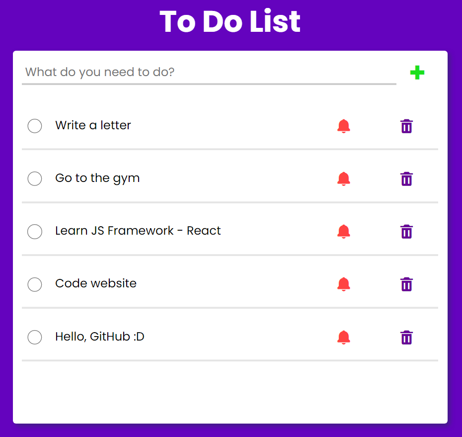

#To Do List

###About Project
***
Training project. Built to practice __**JavaScript**__. List of technologies used:

* ___HTML___
* ___CSS___
* ___JS___

_*Applications for writing a to-do list. Functionality: Add a task, mark it as a priority, mark it as completed, delete a task. The application uses __localstorage__ to save written tasks. __Sorting the list of tasks:__ priority tasks take the top position in the list, completed ones go down.*_

***

__**My contacts:**__

[Telegram](https://t.me/eurokot)
[Instagram](https://www.instagram.com/sadpage.js/)
<a href='mailto:eurokot_dev@mail.ru'>Email</a>

__[Up](#anchor)__